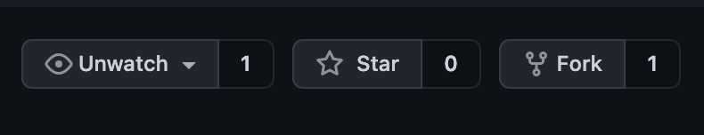
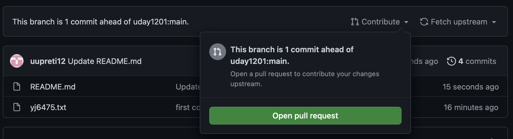
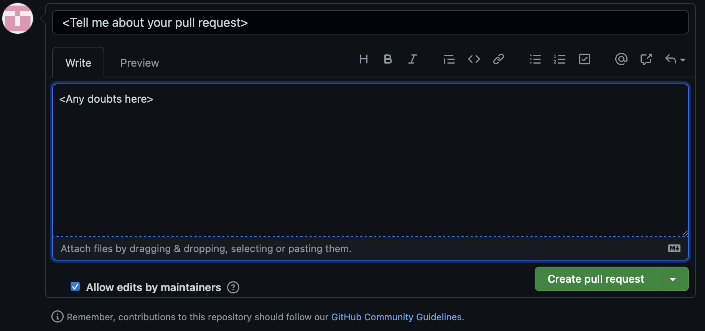

# DSCProjectDummy
This is a dummy project we created to show how to collaborate

- ## Fork this repo
  
  *Click on the Fork button and clone it into your profile*

- ## Clone the repo in your profile
  ```bash
  git clone https://github.com/<YourUsername>DSCProjectDummy.git
  ```
- ## Add a file with name <YourNetId>.txt inside folder **DSCProjectDummy/**

  ```
  Name
  Email
  ```
- ## Add your changes to your local repo

  ```bash
  git add <YourNetId>.txt
  ```

- ## Commit your changes

  ```bash
  git commit -m "<Your commit message>"
  ```

- ## Push your changes

  ```bash
  git push origin master
  ```

- ## Create a PR

  
  *It will show that your repo has changes that is not in mine**

  
  *Keep everything as it is, we are pushing the changes from main branch to main branch of my repo*

  
  *Add information about your PR*

- ## I will review and approve/reject or ask more details in the PR
